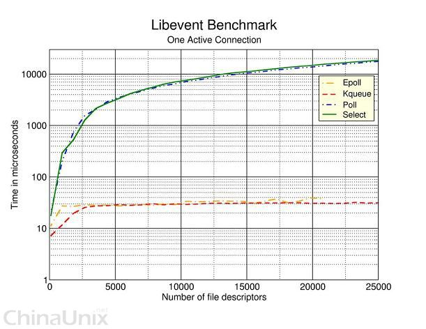

#IO复用---epoll

epoll是从linux内核26开始引入的，在高性能服务器领域得到广泛的应用，现在比较出名的[Nginx](http://nginx.org/)就是使用epoll来实现I/O复用支持高并发。

####epoll用法
epoll的相关系统调用包括三个函数如下：

	int epoll_create(int size); //size是描述符的最大数量，现以不适用该参数，为了兼容才保留，>0即可
	
	int epoll_ctl(int epfd, int op, int fd, struct epoll_event *event); //设置关心的fd及对应的事件
	
	int epoll_wait(int epfd, struct epoll_event * events, int maxevents, int timeout); //等待事件

相关的数据结构和宏如下：

	typedef union epoll_data {  
    	void *ptr;  
    	int fd;  
    	__uint32_t u32;  
    	__uint64_t u64;  
	} epoll_data_t;  
	
	struct epoll_event {  
    	__uint32_t events; /* Epoll events */  
    	epoll_data_t data; /* User data variable */  
	};  
	
	//Epoll evnents 
	EPOLLIN		表示对应的文件描述符可以读（包括对端SOCKET正常关闭）；
	EPOLLOUT	表示对应的文件描述符可以写；
	EPOLLPRI	表示对应的文件描述符有紧急的数据可读（这里应该表示有带外数据到来）；
	EPOLLERR	表示对应的文件描述符发生错误；
	EPOLLHUP	表示对应的文件描述符被挂断；
	EPOLLET		将EPOLL设为边缘触发(Edge Triggered)模式，这是相对于水平触发(Level Triggered)来说的。
	EPOLLONESHOT	只监听一次事件，当监听完这次事件之后，如果还需要继续监听这个socket的话，需要再次把这个socket加入到EPOLL队列里
	
	//epoll_ctl函数中的op参数可以使用的值
	EPOLL_CTL_ADD：注册新的fd到epfd中；
	EPOLL_CTL_MOD：修改已经注册的fd的监听事件；
	EPOLL_CTL_DEL：从epfd中删除一个fd；

用法直接看代码，[代码来源]()，（这段代码仅用来理解epoll的基本用法，存在不完整性）

	struct epoll_event event;  
  	struct epoll_event *events;  
  	
	efd = epoll_create(0);  // 创建epoll描述符
  	if (efd == -1)  
    {  
      perror ("epoll_create");  
      abort ();  
    }  
  
  	event.data.fd = listenfd;  //假设listenfd是已经建立的socket 文件描述符
  	event.events = EPOLLIN | EPOLLET;//关心读入事件,边缘触发方式  
  	
  	s = epoll_ctl (efd, EPOLL_CTL_ADD, sfd, &event);  //添加描述符及对应的操作和事件

	...//其他需要关心的fd也使用相同的方法添加
	
	for( ; ; )  
   	{  
       nfds = epoll_wait(epfd,events,20,500);  
       for(i=0;i<nfds;++i)  
       {  
           if(events[i].data.fd==listenfd) //有新的连接  
           {  
               int connfd = accept(listenfd,(sockaddr *)&clientaddr, &clilen); //accept这个连接  
               ev.data.fd=connfd;  
               ev.events=EPOLLIN|EPOLLET;  
               epoll_ctl(epfd,EPOLL_CTL_ADD,connfd,&ev); //将新的fd添加到epoll的监听队列中  
           }  
  
           else if( events[i].events&EPOLLIN ) //接收到数据，读socket  
           {  
               int n = read(sockfd, line, MAXLINE)) < 0    //读  
               ev.data.ptr = md;     //md为自定义类型，添加数据，逐一ptr的用法
               ev.events=EPOLLOUT|EPOLLET;  
               epoll_ctl(epfd,EPOLL_CTL_MOD,sockfd,&ev);//修改标识符，等待下一个循环时发送数据，异步处理的精髓  
           }  
           else if(events[i].events&EPOLLOUT) //有数据待发送，写socket  
           {  
               struct myepoll_data* md = (myepoll_data*)events[i].data.ptr;    //取数据  
               sockfd = md->fd;  
               send( sockfd, md->ptr, strlen((char*)md->ptr), 0 );        //发送数据  
               ev.data.fd=sockfd;  
               ev.events=EPOLLIN|EPOLLET;  
               epoll_ctl(epfd,EPOLL_CTL_MOD,sockfd,&ev); //修改标识符，等待下一个循环时接收数据  
           }  
           else  
           {  
               //其他的处理  
           }  
       }  
   	} 
   	close(epfd);

**这里面比较精妙的是，event结构体中的data字段（epoll_data）中的ptr字段，这个字段可以由用户自己设置，我比较喜欢把他设置为回调函数的函数指针，从而每次遍历events的时候可以统一通过ptr调用事件的回调函数。而且这个void *指针指向的数据不会因为epoll_wait的调用而改变。本例子是ptr的另一种用法，使用ptr保存了发送读事件时的数据md（可能是根据读入的数据计算出的需要输出地数据），再等到发送事件时将数据发送出去。这个指针变化无穷，大家可以自由发挥**

**第二个需要注意的是，在epoll\_wait返回后，会将**

####epoll的优势

1 **支持一个进程打开大数目的socket描述符**

select 最不能忍受的是一个进程所打开的FD是有一定限制的，由FD_SETSIZE设置，默认值是1024。对于那些需要支持的上万连接数目的IM服务器来说显然太少了。这时候你一是可以选择修改这个宏然后重新编译内核，不过资料也同时指出这样会带来网络效率的下降，二是可以选择多进程的解决方案（传统的Apache方案），不过虽然linux上面创建进程的代价比较小，但仍旧是不可忽视的，加上进程间数据同步远比不上线程间同步的高效，所以也不是一种完美的方案。不过 epoll则没有这个限制，它所支持的FD上限是最大可以打开文件的数目，这个数字一般远大于2048,举个例子，在1GB内存的机器上大约是10万左右，具体数目可以cat /proc/sys/fs/file-max查看，一般来说这个数目和系统内存关系很大。

2 **效率不随FD数目增加而线性下降** （**这个因素我感觉是epoll性能提升中最重要的，占比重最大的**）

传统的select/poll另一个致命弱点就是当你拥有一个很大的socket集合，不过由于网络延时，任一时间只有部分的socket是“活跃”的，但是select/poll每次调用都会线性扫描全部的集合，导致效率呈现线性下降。但是epoll不存在这个问题，它只会对“活跃”的socket进行操作—这是因为在内核实现中epoll是根据每个fd上面的callback函数实现的。那么，只有“活跃”的socket才会主动的去调用 callback函数，其他idle状态socket则不会，在这点上，epoll实现了一个“伪”AIO，因为这时候推动力在os内核。在一些 benchmark中，如果所有的socket基本上都是活跃的—比如一个高速LAN环境，epoll并不比select/poll有什么效率，相反，如果过多使用epoll_ctl,效率相比还有稍微的下降。但是一旦使用idle connections模拟WAN环境，epoll的效率就远在select/poll之上了。

3 **使用mmap加速内核与用户空间的消息传递**

这点实际上涉及到epoll的具体实现了。无论是select,poll还是epoll都需要内核把FD消息通知给用户空间，如何避免不必要的内存拷贝就很重要，在这点上，epoll是通过内核与用户空间mmap同一块内存实现的。

4 **支持水平触发和边沿触发**
epoll支持两种触发方式，边缘触发的意思是说只在事件发生那次触发一次，不关用户是否对相应地数据做了处理（即使read操作没有完全读完），下次都不再触发。具体关于这两种触发方式请参见[水平触发和边沿触发](http://)。

####epoll的优势主要体现在这种场景
存在大量的需要监听事件的socket，但是其中在某一Interval内处于活跃socket的很少（这种场景在WAN网上是很容易发生的，如果我们把时间的Interval设置为1ms的话，在1ms内处于活跃的socket是很少的，原因一方面是WAN的延时较大，另一方面是）。也就是说，在这种情况下，epoll利用其使用回调的方式查找有事件的描述符的这一特性，在性能是会明显高于以轮训的方式查找事件的select函数,libevent进行了实验分析如下图，当只有一个活跃的链接时，select和poll的调用花费的事件是随之明显增长的。但是当大量的描述符都处于活跃状态时（比如在高速LAN环境中，传输速度很快，socket都处于活跃状态），epoll和select的性能是差别不大的！参考论文[Comparing and Evaluating epoll, select, and poll Event Mechanisms](https://www.kernel.org/doc/ols/2004/ols2004v1-pages-215-226.pdf)中的分析，如Fig3和Fig5比较，Fig3中没有idle connection，epoll和poll的性能几乎相近，但是当设置连接中有10000个idle connection时，随着连接数目的增长，poll和select的响应速度明显上升。

####epoll到底能实现多大的并发

epoll的并发量主要是受到内存的限制，以4G机器为例，[该文](http://www.zhihu.com/question/30772664?sort=created)给出了不同情况下的理论的epoll的极限值。简单地说，数量级大概在几十万的级别。
